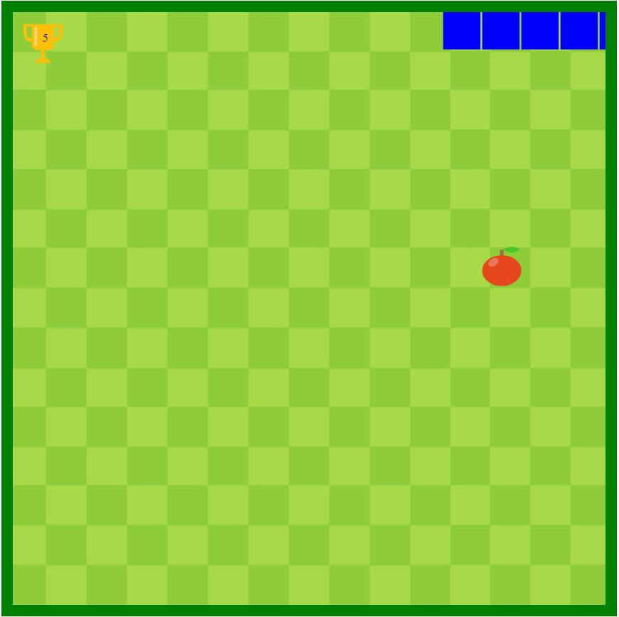

# snake-game
An interactive snake game built using HTML, CSS, and Javascript which used various important concepts including function hoisting, game loop, event listeners etc.
The game uses the implementation of queue data structure working, i.e. the FIFO principle for the dynamic change of length of snake.

